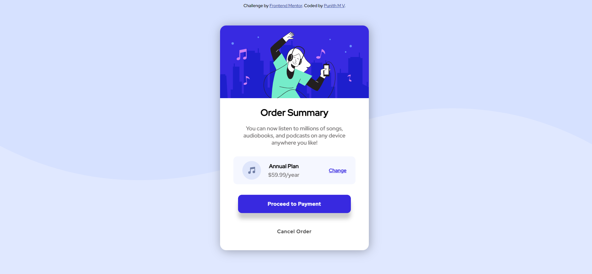
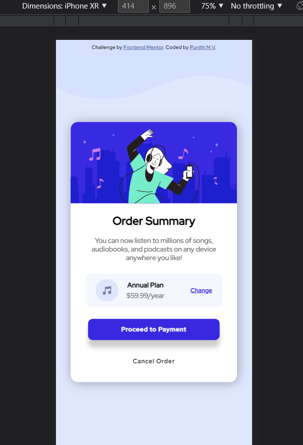

# Frontend Mentor - Order summary card solution

This is a solution to the [Order summary card challenge on Frontend Mentor](https://www.frontendmentor.io/challenges/order-summary-component-QlPmajDUj). Frontend Mentor challenges help you improve your coding skills by building realistic projects. 

## Table of contents

- [Overview](#overview)
  - [The challenge](#the-challenge)
  - [Screenshot](#screenshot)
  - [Links](#links)
- [My process](#my-process)
  - [Built with](#built-with)
  - [What I learned](#what-i-learned)
  - [Continued development](#continued-development)
  - [Useful resources](#useful-resources)
- [Author](#author)
- [Acknowledgments](#acknowledgments)

**Note: Delete this note and update the table of contents based on what sections you keep.**

## Overview

### The challenge

[Order summary card challenge on Frontend Mentor](https://www.frontendmentor.io/challenges/order-summary-component-QlPmajDUj). Frontend Mentor challenges help you improve your coding skills by building realistic projects. 

Users should be able to:

- See hover states for interactive elements

### Screenshot

Desktop

Mobile

### Links

- Solution URL: [Click here](https://github.com/punithmv/frontend-designs)
- Live Site URL: [Click here](https://punithmv.github.io/frontend-designs/)

## My process

### Built with

- Semantic HTML5 markup
- CSS custom properties
- Flexbox
- Mobile-first workflow
- [SASS](https://sass-lang.com/) - For styles

**Note: These are just examples. Delete this note and replace the list above with your own choices**

### What I learned

During this development i was able to get know more about flex and its properties.

### Continued development

As this is simple newbie css challenge, there would be less future development so that i can concentrate on complex challenges.

### Useful resources

- [SASS - CSS with superpowers](https://www.w3schools.com/sass/) - This helped me to understanding how the sass works.

## Author

- Linkedin - [Punith M V](https://www.linkedin.com/in/punith-m-v-bb660b1a4/)
- Frontend Mentor - [@punithmv](https://www.frontendmentor.io/profile/punithmv)

## Acknowledgments

I would like to take a moment to thank everyone who has directly or indirectly helped me to gain knownledge and solve this challenge. 
